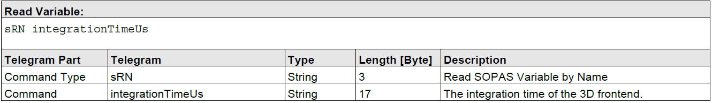
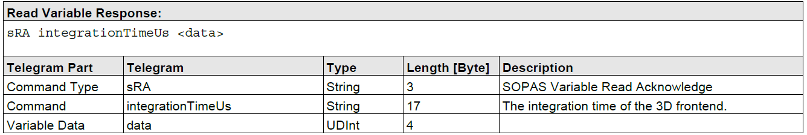
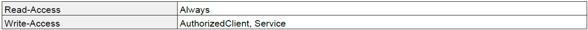
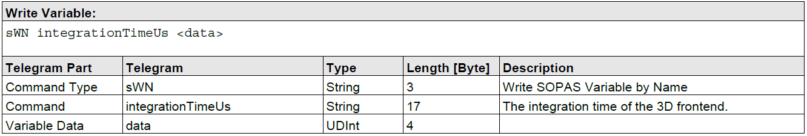
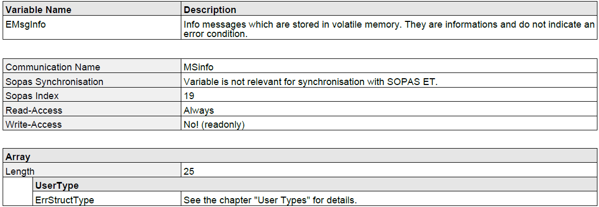
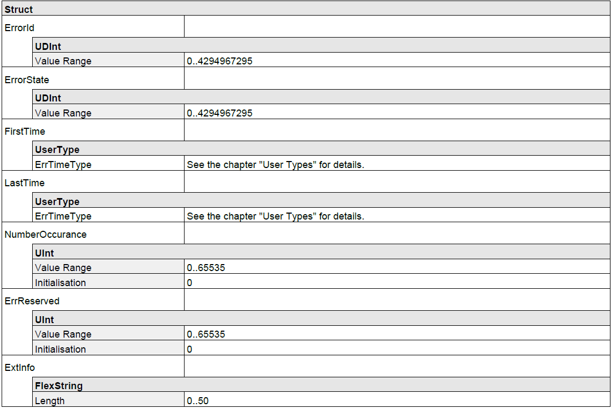
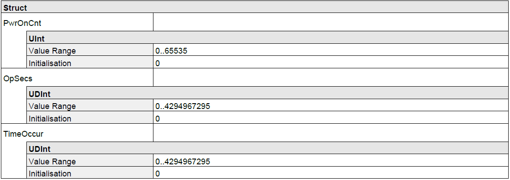

# C++ programming example for Visionary-T cameras

## Table of contents

- [C++ programming example for Visionary-T cameras](#c-programming-example-for-visionary-t-cameras)
    - [Table of contents](#table-of-contents)
    - [Requirements](#requirements)
    - [Quickstart](#quickstart)
        - [Using Visual studio](#using-visual-studio)
        - [Using CMake](#using-cmake)
    - [Code examples](#code-examples)
        - [Connecting to a device](#connecting-to-a-device)
        - [Capturing a single frame](#capturing-a-single-frame)
        - [Continuous frame acquisition](#continuous-frame-acquisition)
        - [Creating a 3D point cloud](#creating-a-3d-point-cloud)
        - [Saving the point cloud to a PLY file](#saving-the-point-cloud-to-a-ply-file)
        - [Device configuration](#device-configuration)
            - [Reading a variable](#reading-a-variable)
            - [Authorization](#authorization)
            - [Writing a variable](#writing-a-variable)
            - [Error handling](#error-handling)
            - [Reading struct and array variables](#reading-struct-and-array-variables)
    - [Support](#support)

## Requirements
Make sure you have already built the project files like described in the file `README.pdf` on the top level folder `sick_visionary_cpp_samples`.
Then the sample contains a Visual Studio Solution file as well as a CMakeLists file. To open and compile it with Microsoft Visual Studio at least Version of 2015 is needed. For platform independent compiling the CMakeLists is available, which needs at least CMake 2.8 with support for C++11.

## Quickstart
### Using Visual studio
1. Open the SampleVisionaryT.sln file with Visual Studio
2. Set The SampleVisionaryT for your device type as StartUp project
3. Start the debugger and the sample will automatically connect to a Visionary-T camera with default IP (`192.168.1.10`) and default API-Port (`2114`). To change them modify the function call to `runStreamingDemo` in the main function or call the executable with the corrosponding parameters (Start with -h to see all possibilities).

### Using CMake
1. Run CMake on the CMakeLists file.
2. This should end with an executable for your platform.
3. Start the debugger and the sample will automatically connect to a Visionary-T camera with default IP (`192.168.1.10`) and default API-Port (`2114`). To change them modify the function call to `runStreamingDemo` in the main function or call the executable with the corrosponding parameters (Start with -h to see all possibilities).

## Code examples
This section covers the different parts of the sample in more detail and how to adjust them to work for your own applications.

### Connecting to a device
The first step is to initialize a data handler, a data stream, and a camera control object:

```c++
#include <boost/shared_ptr.hpp>
#include <boost/make_shared.hpp>

#include "VisionaryControl.h"
#include "VisionaryTData.h"
#include "VisionaryDataStream.h"
[...]
boost::shared_ptr<VisionaryTData> pDataHandler = boost::make_shared<VisionaryTData>();
VisionaryDataStream dataStream(pDataHandler);
VisionaryControl visionaryControl;
```

The next step is to open both the data stream and control connections. Both of them return a `bool` specifying if the connection was successful or not. The `ipAddress` (default `192.168.1.10`), control protocol type (CoLa B) and `dataPort` (default `2114`) variables specifies which device to connect to:
```c++
if (!dataStream.open(ipAddress, htons(dataPort)))
{
    // Data stream connection failed
}
if (!visionaryControl.open(VisionaryControl::ProtocolType::COLA_B, ipAddress, 5000/*ms*/))
{
    // Device control (CoLaB) connection failed
}
```

There is now a connection established to the device and it is possible to start communicating with it. When you no longer wish to communicate with the device it is important to close both connections:
```c++
visionaryControl.close();
dataStream.close();
```

### Capturing a single frame
The camera default mode is capturing continous images. The acquisition can be stopped and in stopped mode also single snapshots can be done:
```c++
if(control.stopAcquisition())
{
    // Image acquisition is stopped
}
if(control.stepAcquisition())
{
    // One single frame is acquired
}
if(control.startAcquisition())
{
    // Continous image acquisition is started
}
```

It is then possible to use the data stream connection to get the next frame. The received frame will then be accessable via the data handler which was provided to the data stream object:
```c++
if (dataStream.getNextFrame())
{
    int width = pDataHandler->getWidth();                                           // Image width
    int height = pDataHandler->getHeight();                                         // Image height
    uint32_t frameNumber = pDataHandler->getFrameNum();                             // Frame number
    uint64_t timestamp = pDataHandler->getTimestampMS();                            // Frame timestamp in milliseconds 
    const std::vector<uint16_t> distanceMap = pDataHandler->getDistanceMap();       // Distance values
    const std::vector<uint16_t> intensityMap = pDataHandler->getIntensityMap();     // Intensity values
    const std::vector<uint16_t> confidenceMap = pDataHandler->getConfidenceMap();   // Confidence values
    // For AG devices also polar or cartesian data can be get if enabled
    std::vector<float> scanPoints = pDataHandler->getPolarDistanceData();           // Polar scan points
    std::vector<PointXYZC> cartesian = pDataHandler->getCartesianData();            // Cartesian values as points with X, Y, Z and confidence
    // For DT devices the detection results can be get if enabled
    std::vector<PointXYZC> cartesian = pDataHandler->getCartesianData();            // Detection values as points with position in X and Y and detection result
}
```

### Continuous frame acquisition
To get a continuous stream of frames, first set the camera to Continuous mode and use the data stream object to get as many frames as required:
```c++
control.startAcquisition();
for (int i = 0; i < 100; i++)
{
    if (dataStream.getNextFrame())
    {
        std::printf("Frame received in continuous mode, frame #%d \n", pDataHandler->getFrameNum());
    }
}
```

Once all required frames are received it is recommended to set the camera in Manual mode again:
```c++
control.stopAcquisition();
```

### Creating a 3D point cloud
Every received frame contains all required data to calculate a 3D point cloud. A point cloud is a list of 3D coordinates. The data handler contains a convenience method which converts the latest received frame to a point cloud:
```c++
#include "PointXYZ.h"
[...]
if (dataStream.getNextFrame())
{
    std::vector<PointXYZ> pointCloud;
    pDataHandler->generatePointCloud(pointCloud);
    // Transform the point cloud with the mounting position of the device
    pDataHandler->transformPointCloud(pointCloud);
}
```
*For increased performance the data handler internally caches some of the calculations and reuses this for the next frames.*

### Saving the point cloud to a PLY file
The C++ sample code also contains a convenience method for writing the generated point cloud to a [PLY (Polygon File Format)](https://en.wikipedia.org/wiki/PLY_(file_format)) file:
```c++
#include "PointCloudPlyWriter.h"
[...]
PointCloudPlyWriter::WriteFormatPLY(
    "MyPointCloud.ply",              // File to write to
    pointCloud,                      // The list of 3D positions
    pDataHandler->getIntensityMap(), // The list of intensity values (optional)
    true);                           // Enable binary
```
The method supports writing both ASCII and Binary PLY files, and is controlled by the last parameter. Binary is recommended as it is much faster to write, and significantly reduces the file size.

The intensity values parameter can be omitted if your application doesn't need them.

### Device configuration
It is also possible to both read and write the device configuration variables using C++. This is done by sending and receiving CoLa B commands to and from the device. When reading or writing variables, or invoking a device method the general approach is:

1. Create a CoLa B command
2. Send the created command to the device
3. Receive the response command from the device
4. Parse the response command

A CoLa B command is made up of a `type`, a `name`, and any number of parameters. The name and which parameters to use for a specific command is specified in the *CID Visionary ... pdf* (CID stands for *SOPAS Communication Interface Description*) document.

#### Reading a variable
The goal in this example is to read the `integrationTimeUs` variable  from the device. The first step is to find the variable in the *CID Visionary ... pdf* document, and go to the *Variable Telegram Syntax* part, for `integrationTimeUs` the first table (*Read Variable:*) looks like this:


This specifies that to read the variable a CoLa B command must be constructed with the name `integrationTimeUs` (**_Note:_** this might not always match the variable name!) and no additional parameters.

The easiest way to create such a command is to use the `CoLaParameterWriter`:
```c++
#include "CoLaParameterWriter.h"
[...]
CoLaCommand getIntegrationTimeCommand = CoLaParameterWriter(CoLaCommandType::READ_VARIABLE, "integrationTimeUs").build();
```

The next step is to send the command to the device, and receive the response:
```c++
CoLaCommand integrationTimeResponse = visionaryControl.sendCommand(getIntegrationTimeCommand);
```

To be able to parse the response command it is again required to consult the *CID Visionary ... pdf* document to see what the response contains. This time look for the table *Read Variable Response:*, which for the `integrationTimeUs` variable looks like this:


The important part from this table is the *Variable Data* entry which specifies that the response contains a single value of type `UDInt` (Unsigned Double Integer). This knowledge can then be used together with a `CoLaParameterReader` to read the actual value.

```c++
#include "CoLaParameterReader.h"
[...]
uint32_t integrationTimeUs = CoLaParameterReader(integrationTimeResponse).readUDInt();
```

#### Authorization
Most variables can be read without any specific permission, but writing them often requires a login to be performed first. In the *CID Visionary ... pdf* document the required access level for variables are specified in the "Variable Overview" table, and for the `integrationTimeUs` variable looks like this:


Before writing to a variable one of the specified *Write-Access* levels must be set, this can be done using CoLa B commands as well, but the control object has a convenience method for this, the first parameter is the requested access level, and the second parameter is the password for that level: 
```c++
if (visionaryControl.login(IAuthentication::UserLevel::AUTHORIZED_CLIENT, "CLIENT"))
{
    // Login was successful
}
```

The method returns a `bool` specifying whether the login attempt was successful or not. After finishing writing all variables it is recommended to logout:
```c++
if (!visionaryControl.logout())
{
    // Logout was not successfull
}
```

#### Writing a variable
The steps to write a variable are very similar to reading a variable. The first step is to find the *Write Variable:* table for the variable, in this case for `integrationTimeUs`:


As expected, the *Variable Data* parameter here is also a `UDInt`. Again the `CoLaParameterWriter` is used to construct the command to send to the device:
```c++
CoLaCommand setIngrationTimeCommand = CoLaParameterWriter(CoLaCommandType::WRITE_VARIABLE, "integrationTimeUs").parameterUDInt(3800).build();
```

Compared to reading the variable the type is now set to `WRITE_VARIABLE`, and a `UDInt` parameter is also appended. Because writing a variable doesn't return anything there is no need to parse the result, but it is recommended to check for errors (see next section).


#### Error handling
When reading and writing variables in a real application it is recommended to check the response for errors:
```c++
#include "CoLaError.h"
[...]
CoLaCommand setIngrationTimeResponse = visionaryControl.sendCommand(setIngrationTimeCommand);
if (getIntegrationTimeResponse.getError() == CoLaError::OK)
{
    // Command was successful
}
else
{
    // There was an error when executing the command.
}
```

#### Reading struct and array variables
So far the variable has only had a single value but variables can actually contain either a struct of multiple values, an array of values, or even an array of structs. This example will show how to read the variable `EMsgInfo` which contains all info log messasges in the device. Again the first step is to look up the variable definition, this is the *Variable Overview*:


There are a few important things to notice here:

- The *Communication Name* does not match the variable name.
- The *Write-Access* is *No!* which means the variable can not be written to.
- The data is an `Array` of `ErrStructType` elements.
- The array always contains 25 items.

As a first step construct a read command and send it to the device, notice that the *Communication Name* is used and not the variable name:
```c++
CoLaCommand getMessagesCommand = CoLaParameterWriter(CoLaCommandType::READ_VARIABLE, "MSinfo").build();
CoLaCommand messagesResponse = visionaryControl.sendCommand(getMessagesCommand);
```

The next step is to parse the response. For this it is required to lookup the `ErrStructType` definition in the *CID Visionary ... pdf* document, which looks like this:


As seen above this struct contains seven different values with different types. Also notices that the `FirstTime` and `LastTime` members are of type `ErrTimeType`, this struct can also be found in the document:


Together with the knowledge that the array always contains 25 items it is now possible to parse the response command using a `CoLaParameterReader`:

```c++
CoLaParameterReader reader(messagesResponse);
for (int i = 0; i < 25; i++) // Read 25 items
{
    uint32_t errorId = reader.readUDInt();
    uint32_t errorState = reader.readUDInt();

    // Read ErrTimeType struct members for FirstTime
    uint16_t firstTime_PwrOnCount = reader.readUInt();
    uint32_t firstTime_OpSecs = reader.readUDInt();
    uint32_t firstTime_TimeOccur = reader.readUDInt();

    // Read ErrTimeType struct members for LastTime
    uint16_t lastTime_PwrOnCount = reader.readUInt();
    uint32_t lastTime_OpSecs = reader.readUDInt();
    uint32_t lastTime_TimeOccur = reader.readUDInt();

    uint16_t numberOccurance = reader.readUInt();
    uint16_t errReserved = reader.readUInt();
    std::string extInfo = reader.readFlexString();

    // Write all non-empty info messages to the console
    if (errorId != 0)
    {
        std::printf("Info message [0x%032x], extInfo: %s, numberOccurance: %d\n", errorId, extInfo.c_str(), numberOccurance);
    }
}
```

**_Note:_** It is important to read the values in the same order as they appear in the table! Use `reader.rewind();` to read from the beginning of a command again.

## Support
For questions about the C++ sample contact: 

[TechSupport0905@sick.de](mailto:TechSupport0905@sick.de)